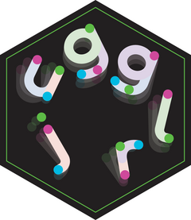
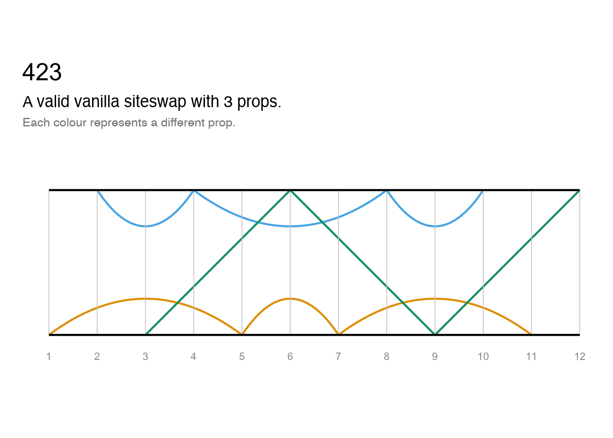
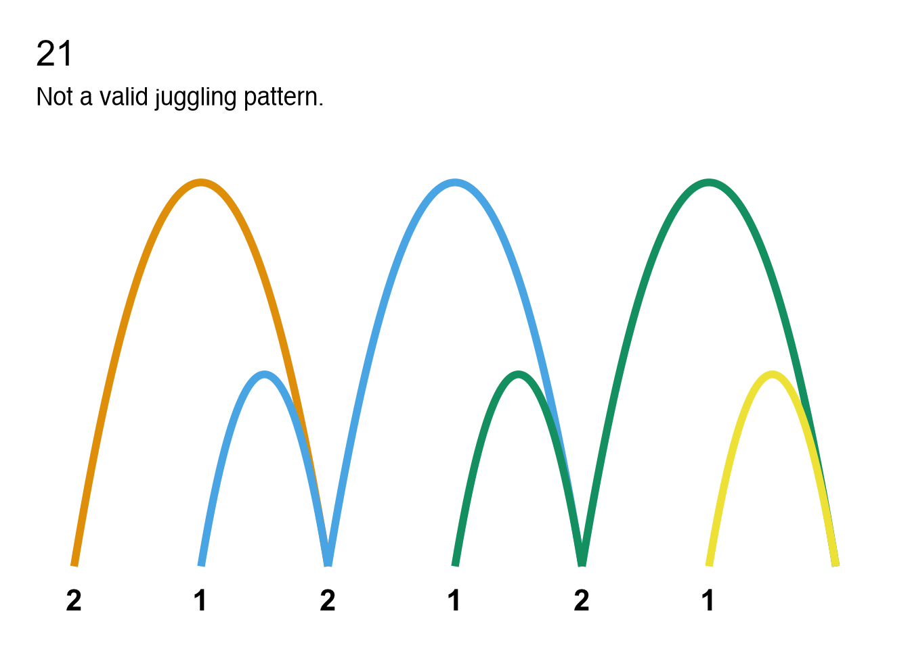

<!-- README.md is generated from README.Rmd. Please edit that file -->

# jugglr <a href="https://ellakaye.github.io/jugglr/"></a>

<!-- badges: start -->

[](https://app.codecov.io/gh/EllaKaye/jugglr)
[](https://github.com/EllaKaye/jugglr/actions/workflows/R-CMD-check.yaml)
<!-- badges: end -->

**jugglr** is an R package for validating and visualising juggling
patterns expressed in [siteswap
notation](https://en.wikipedia.org/wiki/Siteswap). The `siteswap()`
function is a factory that auto-detects the notation type and returns an
S7 object of the appropriate subclass: `vanillaSiteswap`,
`synchronousSiteswap`, `multiplexSiteswap`,
`synchronousMultiplexSiteswap`, or `passingSiteswap`, all of which
inherit from an abstract `Siteswap` parent class. Functions such as
`timeline()`, `ladder()`, and `throw_data()` work across all these types
via dedicated methods for each subclass.

## Installation

You can install the development version of jugglr from
[GitHub](https://github.com/EllaKaye/jugglr) with:

``` r
# install.packages("pak")
pak::pak("EllaKaye/jugglr")
```

## Siteswap

The `siteswap()` function auto-detects the notation type and returns the
appropriate subclass. Each object’s print method reports whether the
pattern is valid, how many props it requires, and its period and
symmetry.

### Vanilla

``` r
library(jugglr)
ss423 <- siteswap("423")
ss423
#> ✔ '423' is valid vanilla siteswap
#> ℹ It uses 3 props
#> ℹ It is symmetrical with period 3
```

### Synchronous

``` r
ss44 <- siteswap("(4,4)")
ss44
#> ✔ '(4,4)' is valid synchronous siteswap
#> ℹ It uses 4 props
#> ℹ It is symmetrical with period 2
```

Alternation notation is also supported: `siteswap("(4,2x)*")` expands
`*` into a full two-beat cycle.

### Passing

``` r
ss_pass <- siteswap("<3p 3|3p 3>")
ss_pass
#> ✔ '<3p 3|3p 3>' is valid passing siteswap
#> ℹ It uses 6 props across 2 jugglers
#> ℹ It is asymmetrical with period 2
```

Fractional notation (e.g. `"<4.5 3 3 | 3 4 3.5>"`) is also supported for
passing patterns. Multiplex (`"[43]1"`) and synchronous multiplex
(`"(4,[42x])*"`) patterns are supported too.

### Invalid patterns

Patterns that cannot be juggled are caught at construction time:

``` r
ss21 <- siteswap("21")
ss21
#> ✖ '21' is not a valid juggling pattern
#> ℹ The throws don't average to a whole number
#> ℹ Two or more throws land on the same beat (collision)
```

## Visualising the patterns

`timeline()` and `ladder()` work across all siteswap types, returning
ggplot2 objects that can be further customised. `throw_data()` returns
the underlying data frame for use in custom visualisations.

### Plots

``` r
timeline(ss423)
```


``` r
ladder(ss423)
```



These plots are also useful for understanding why non-valid sequences
are not jugglable. We can see, for example, where two props would need
to be caught at the same time (which is not permissible in vanilla
siteswap). Because each prop is shown in a different colour, we can see
where balls are disappearing or needing suddenly to appear.

``` r
timeline(ss21)
```



``` r
ladder(ss21)
```


### Animation

**jugglr** provides a wrapper to the [JugglingLab GIF
server](https://jugglinglab.org/html/animinfo.html). The `animate()`
function accepts valid siteswap sequences as plain strings or as any
`Siteswap` object. Note that the JugglingLab GIF server does not
recognise fractional notation, so `passingSiteswap` objects using
fractional notation cannot be animated.

If called in Positron or RStudio, `animate()` will show the animation in
the Viewer pane, otherwise in the browser. If a `path` argument is
supplied, the animation will be saved to that location instead. Note
that it can take several seconds for the animation to render.

To save a GIF for embedding in an R Markdown or Quarto document, pass a
`path` argument to `animate()`, then reference the saved file with
`knitr::include_graphics()`. Display options can be set as chunk
arguments:

``` r
animate("423", path = "man/figures/423-animation.gif", colors = c("#E69F00", "#56B4E9", "#009E73"))
```


