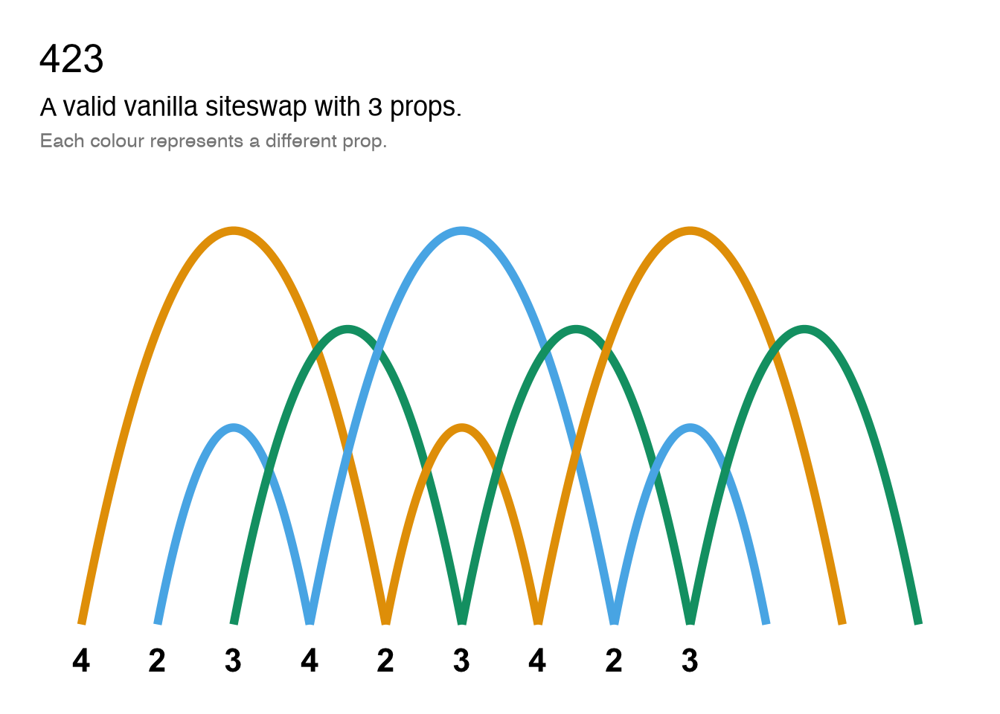
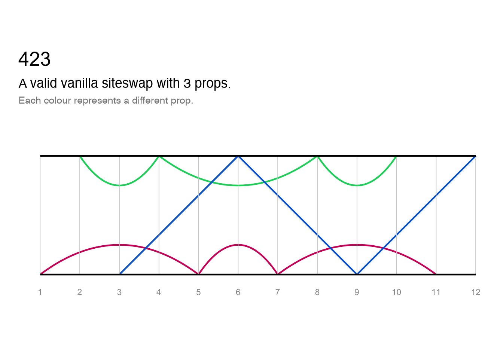
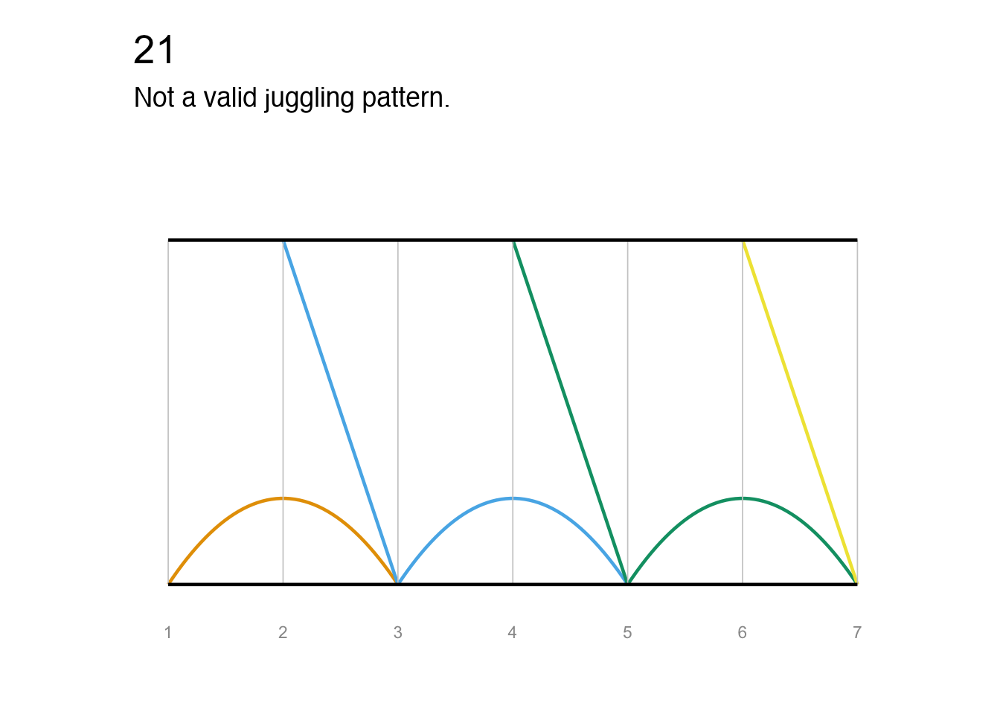

<!-- README.md is generated from README.Rmd. Please edit that file -->

# jugglr

<!-- badges: start -->

<!-- badges: end -->

**jugglr** is a work-in-progress package to validate and visualise
juggling patterns. The `siteswap()` function takes a sequence written in
[siteswap notation](https://en.wikipedia.org/wiki/Siteswap) and creates
an S7 object with class `Siteswap` and a child class for the type of
siteswap, e.g. vanillaSiteswap.

At present, only vanilla siteswap is implemented. I plan to support
synchronous and multiplex siteswap in the near future, and passing
siteswap after that.

**Note that not all functions are currently documented and test coverage
is poor - both are works-in-progress.**

## Installation

You can install the development version of jugglr from
[GitHub](https://github.com/) with:

``` r
# install.packages("pak")
pak::pak("EllaKaye/jugglr")
```

## Siteswap

Once a Siteswap object is created, it’s print method will display
information about the sequence, such as whether it is a valid juggling
pattern and, if so, how many props it uses.

``` r
library(jugglr)
# A valid juggling pattern
ss423 <- siteswap("423")
ss423
#> ✔ '423' is valid vanilla siteswap
#> ℹ It uses 3 props
#> ℹ It is symmetrical with period 3
```

``` r
# A pattern that cannot be juggled
ss21 <- siteswap("21")
ss21
#> ✖ This siteswap is not a valid juggling pattern
```

## Visualising the patterns

There are three ways of visualising the siteswap patterns:

- A timeline plot, which shows the throws by beat
- A ladder diagram, which shows the throws by beat and hand
- An animation (only if the pattern is valid)

### Plots

These functions take `Siteswap` objects as their argument (currently
only `vanillaSiteswap`). They return ggplot2 plots, so can be further
customised.

``` r
palette <- c("#D4006A", "#00D46A", "#006AD4")
timeline(ss423) +
  ggplot2::scale_color_manual(values = palette)
```



``` r
ladder(ss423) +
  ggplot2::scale_color_manual(values = palette)
```



These plots are also useful for understand why non-valid sequences are
not jugglable. We can see, for example, where two props would need to be
caught at the same time (which is not permissible in vanilla siteswap).
Because each prop is shown in a different colour, we can see where balls
are disappearing or needing suddenly to appear.

``` r
timeline(ss21)
```


``` r
ladder(ss21)
```



### Animation

**jugglr** provides a wrapper to the [JugglingLab GIF
server](https://jugglinglab.org/html/animinfo.html). Unlike the plotting
functions, the main argument is any *valid* siteswap sequence as a
string.

If called in Positron or RStudio, `animate()` will show the animation in
the Viewer pane, otherwise in the browser. If a `path` argument is
supplied, the animation will be saved to that location instead. Note
that it can take several seconds for the animation to render.

For embedding in RMarkdown or quarto documents, there is a wrapper,
`animate_markdown()`, which calls `knitr::include_graphics()`, and
display options can be set as chunk arguments (e.g. for the output
below, `out.width="40%")`:

``` r
animate_markdown("423", "man/figures/423-animation.gif", colors = palette)
#> ✔ Animation saved to: 'man/figures/423-animation.gif'
```


