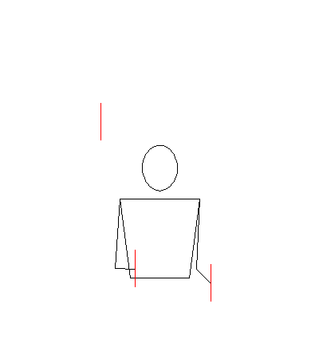

# Animating juggling patterns

``` r

library(jugglr)
```

Before you run
[`animate()`](https://ellakaye.github.io/jugglr/reference/animate.md),
know this: it talks to a server at
[jugglinglab.org](https://jugglinglab.org) and downloads a GIF. You need
an internet connection. The time it takes depends on the options you
pass and whether JugglingLab has the pattern cached — typically a few
seconds for a simple call, longer when you specify colours.

What you get back is a full animation of the pattern. For a juggler
learning a new trick, or communicating a pattern to someone else, it’s
the most informative thing jugglr can produce.

## Basic usage

Pass a pattern as a string:

``` r

animate("531")
```


In Positron or RStudio, the animation appears in the Viewer pane.
Otherwise it opens in the browser.

You can also pass any `Siteswap` object directly — jugglr extracts the
sequence string for you:

``` r

animate(siteswap("531"))
```

The animation is identical either way.

One limitation: `passingSiteswap` objects using fractional notation
(e.g. `"<4.5 3 3 | 3 4 3.5>"`) can’t be animated because JugglingLab
doesn’t recognise that format. P-notation passing patterns
(e.g. `"<3p 3|3p 3>"`) work fine.

## Colours

The `colors` argument is the most visually impactful option.

**No colours specified** — JugglingLab uses its default (a single
colour):

``` r

animate("531")
```

**`colors = "mixed"`** — each prop gets a different colour. Useful for
tracking individual balls through the pattern:

``` r

animate("531", colors = "mixed")
```


**`colors = "orbits"`** — props that follow the same path through the
pattern share a colour. This is the most analytically useful mode: it
shows you the orbit structure at a glance:

``` r

animate("531", colors = "orbits")
```


**Custom colours** — a vector of R colour names or hex codes, one per
prop:

``` r

animate("531", colors = c("#E69F00", "#56B4E9", "#009E73"))
```


These are the same Okabe-Ito colours used in
[`timeline()`](https://ellakaye.github.io/jugglr/reference/timeline.md)
and [`ladder()`](https://ellakaye.github.io/jugglr/reference/ladder.md)
— a good choice if you want consistency across your visualisations.

Note that specifying colours takes noticeably longer than the default,
because the coloured version isn’t typically cached on the JugglingLab
server.

## Props

The default prop is a ball. Rings and an image prop are also available:

``` r

animate("531", prop = "ring")
```



``` r

animate("531", prop = "image")
```


## Speed and timing

Two parameters control the animation speed.

`slowdown` stretches the throw arcs in time — the JugglingLab default is
`2.0`. Increase it to slow the animation down, which is useful when
you’re studying a new pattern:

``` r

animate("531", slowdown = 4)
```


`bps` sets the beats per second — the tempo of the pattern. Increase it
to see the pattern at full juggling speed:

``` r

animate("531", bps = 8)
```


`width` and `height` control the pixel dimensions of the animation if
you need a specific size.

## Saving animations to disk

To embed an animation in an R Markdown or Quarto document, save it to
disk first and then reference the file:

``` r

animate("531", path = "figures/531.gif", colors = "orbits")
```

Then in a separate chunk:

``` r

knitr::include_graphics("figures/531.gif")
```

Set display options via chunk arguments: `out.width = "40%"` keeps the
GIF from filling the full page width. This is the approach used
throughout this vignette.

## Advanced parameters

[`animate()`](https://ellakaye.github.io/jugglr/reference/animate.md)
passes additional named arguments through to JugglingLab. A few worth
knowing:

- `gravity`: the default feels like Earth. Set `gravity = 700` for a
  pattern that looks like it’s being juggled somewhere with lower
  gravity:

``` r

animate("531", gravity = 700)
```


- `propdiam`: prop diameter in metres. Adjust if the props look too
  large or small relative to the juggler.
- `camangle`: camera angle in degrees around the vertical axis. Useful
  for a different perspective on the pattern.
- `showground`: set to `true` to show the ground plane.

The full list of parameters is documented in the [JugglingLab GIF server
reference](https://jugglinglab.org/html/animinfo.html).
