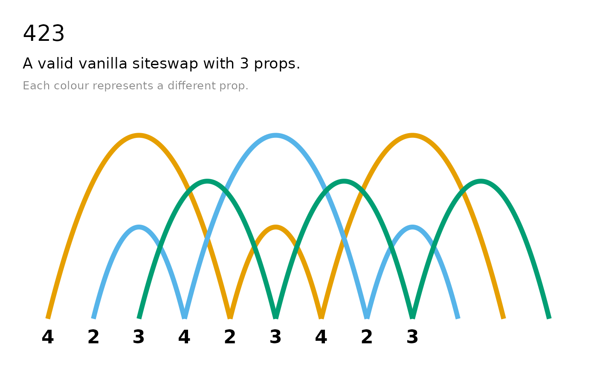
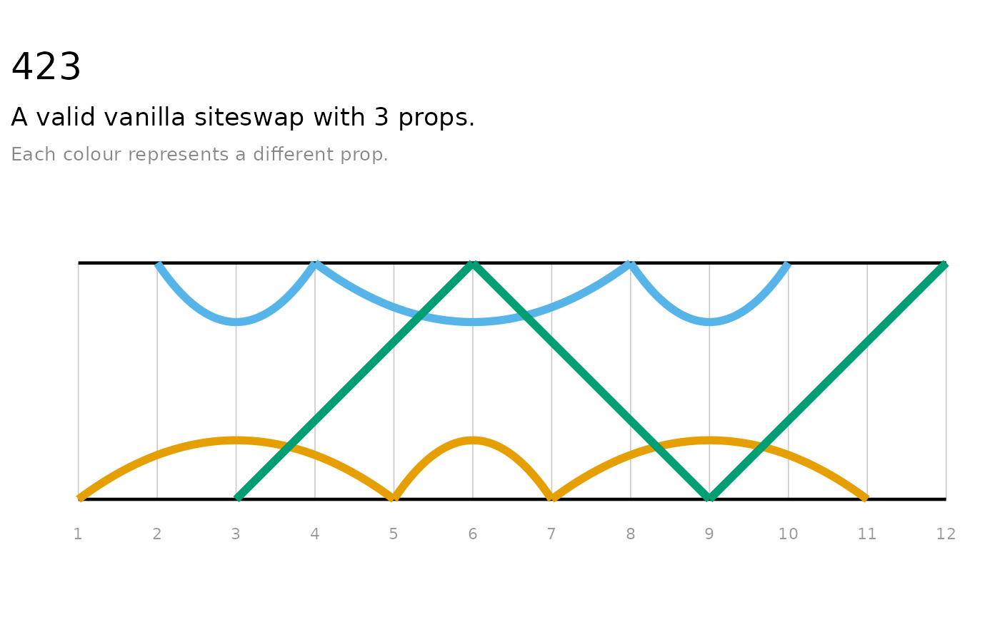
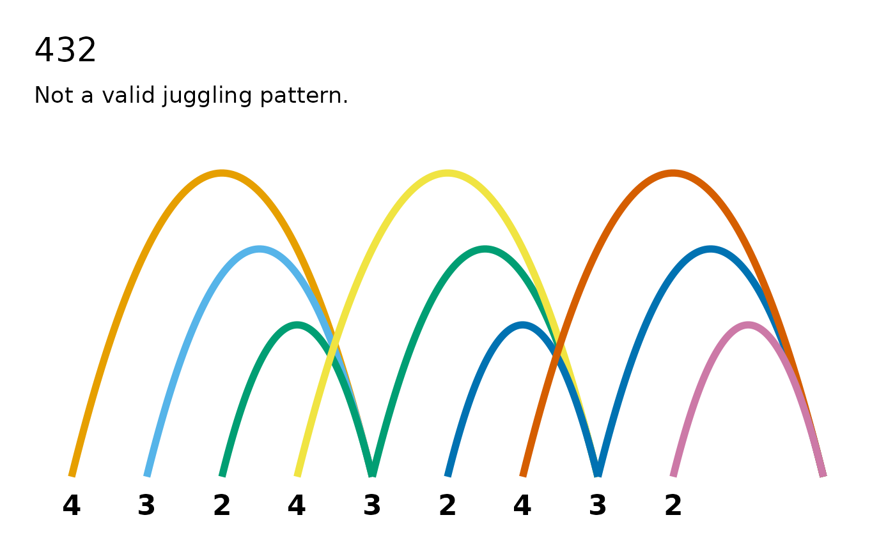
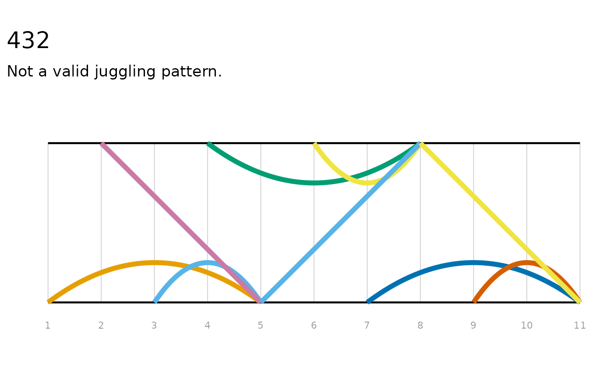
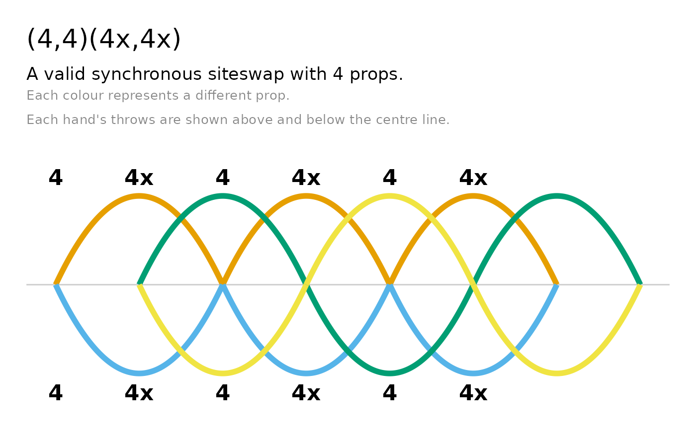
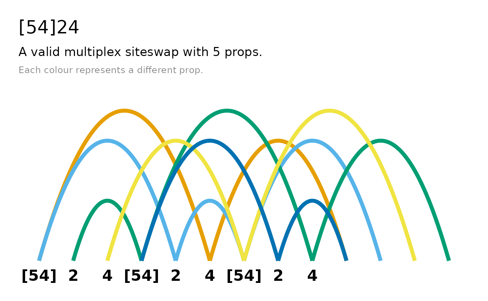
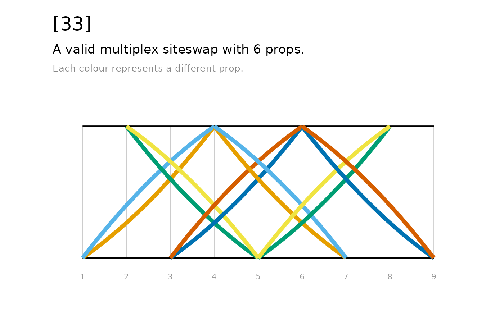

# Get started with jugglr

``` r

library(jugglr)
```

## Introduction to siteswap

Juggling sequences can be written in a notation called siteswap. Each
number in a siteswap sequence encodes how many beats until that prop is
thrown again. The simplest form is *vanilla* siteswap: one prop thrown
per beat, hands alternating.

A 3-ball cascade — the first sequence most jugglers learn — is written
as “3”, where each ball is thrown the same height, caught in the
opposite hand and thrown again three beats later. “531”, “423” and “441”
are also valid 3-ball juggling patterns. The sequence “4” represents the
4-ball fountain, where each “4” is thrown and caught in the same hand. A
“5” throw is similar to a “3” but thrown higher. A “2” is held in the
hand for one beat then thrown, and a “1” is a quick pass to the other
hand. However, not everything that can be written in siteswap is a
valid, juggleable pattern. For example, in the sequence “432”, the first
two props thrown would need to be caught in the same hand at the same
time.

There are other types of siteswap, which relax the requirements of
vanilla siteswap in some way, distinguished by their notation. These
include synchronous, multiplex, synchronous multiplex, and passing,
shown here with with examples:

- vanilla:**423**
- synchronous (throwing a ball from each hand simultaneously):
  **(4,4)(4x,4x)**, **(4,2x)\***
- multiplex (throwing multiple balls from the same hand simultaneously):
  **\[54\]24**
- synchronous multiplex: **(2,6x)(\[6x4x\],2x)**
- passing (throwing between more than one juggler): **\<3p33\|3p33\>**,
  **\<4.5 3 3 \| 3 4 3.5\>**

See the Wikipedia article on
[siteswap](https://en.wikipedia.org/wiki/Siteswap) for a more detailed
introduction to each type and the notation.

## Introduction to jugglr

**jugglr** lets you create, validate, and visualise siteswap patterns in
R. In **jugglr**, you define a sequence with the function
[`siteswap()`](https://ellakaye.github.io/jugglr/reference/siteswap.md),
which creates an [S7](https://rconsortium.github.io/S7/) object with
class `Siteswap` as well as a child class corresponding to its type:
`vanillaSiteswap`, `synchronousSiteswap`, `multiplexSiteswap`,
`synchronousMultiplexSiteswap`, or `passingSiteswap`.

``` r

library(jugglr)
ss423 <- siteswap("423")
ss423
#> ✔ '423' is valid vanilla siteswap
#> ℹ It uses 3 props
#> ℹ It is symmetrical with period 3
```

Note that
[`siteswap()`](https://ellakaye.github.io/jugglr/reference/siteswap.md)
is a factory function. It parses the sequence to determine the type of
siteswap and calls the appropriate constructor for that type,
e.g. [`vanillaSiteswap()`](https://ellakaye.github.io/jugglr/reference/vanillaSiteswap.md).
Each of these specific classes also has the abstract `Siteswap` class as
a parent.

Printing a `Siteswap` object shows the sequence and whether it is a
valid juggling pattern. For valid sequences, it also reports the number
of props the pattern requires, its period (how many beats before it
repeats), and whether it is symmetrical (i.e. whether both hands do the
same thing, just offset in time).

Patterns that cannot be juggled are still `Siteswap` objects with the
appropriate subclass. Their print method reports that they are not valid
juggling patterns. For patterns that aren’t valid, it reports why not:
either the sequence does not satisfy the average theorem (i.e. couldn’t
be juggled with a whole number of props) or it has collisions.

``` r

ss432 <- siteswap("432")
ss432
#> ✖ '432' is not a valid juggling pattern
#> ℹ Two or more throws land on the same beat (collision)
```

## Visualising the patterns

jugglr implements two types of plots to visualise siteswap sequences,
[`timeline()`](https://ellakaye.github.io/jugglr/reference/timeline.md)
and [`ladder()`](https://ellakaye.github.io/jugglr/reference/ladder.md).
They both work across all siteswap types, returning ggplot2 objects that
can be further customised. In both, the path of each prop is shown in a
different colour, using the colour-blind-friendly [Okabe-Ito
palette](https://clauswilke.com/dataviz/color-pitfalls.html#not-designing-for-color-vision-deficiency)
(up to seven props, after which ggplot2’s default scale takes over).

[`timeline()`](https://ellakaye.github.io/jugglr/reference/timeline.md)
shows the throws and catches of each prop over time, with a focus on the
beat. It draws arcs: each arc represents one throw, with height
proportional to the throw value.

[`ladder()`](https://ellakaye.github.io/jugglr/reference/ladder.md) is
also plotted by bear, additionally showing which hand throws and catches
each prop. The ‘rails’ of the ladder represent the hands, with straight
lines between them representing throws caught in the opposite hand, and
arcs representing throws caught in the same hand.

**Note that the plots look better in the [vignette on the package
website](https://ellakaye.github.io/jugglr/articles/jugglr.html) - we
recommend reading it there rather than the locally installed copy.**

### Vanilla

``` r

timeline(ss423)
```



``` r

ladder(ss423)
```



These plots are also useful for understanding why non-valid sequences
are not jugglable. We can see, for example, where two props would need
to be caught at the same time (which is not permissible in vanilla
siteswap), or where props are “created” or “destroyed” (i.e. when the
sequence demands that a prop should be thrown or caught, but there’s not
a prop available to do so).

``` r

timeline(ss432)
```



``` r

ladder(ss432)
```



### Synchronous

[`timeline()`](https://ellakaye.github.io/jugglr/reference/timeline.md)
plots for synchronous patterns are drawn two-sided: the arcs for props
thrown from one hand sit above a faint centre line, and arcs from the
other hand below it.

``` r

timeline(siteswap("(4,4)(4x,4x)"))
```



### Multiplex

In multiplex patterns, more than one ball can be thrown from the same
hand at the same time.

``` r

timeline(siteswap("[54]24"))
```



Multiplex patterns in which a hand throws two props at once with the
same value are fanned apart so each prop is visible (which corresponds
to the way jugglers throw them in real life). By detault, timelines show
three cycles of the pattern, but you can increase this with the
`n_cycles` argument - this is recommended for patterns with short
cycles:

``` r

ladder(siteswap("[33]"), n_cycles = 6)
```



### Passing

Passing patterns show one lane per juggler, with passes appearing as
arcs (or lines) that cross between the juggler lanes.:

``` r

timeline(siteswap("<3p 3 3|3p 3 3>"))
```


### Customising the plots

Both
[`timeline()`](https://ellakaye.github.io/jugglr/reference/timeline.md)
and [`ladder()`](https://ellakaye.github.io/jugglr/reference/ladder.md)
have `title` and `subtitle` arguments, which are `TRUE` by default - the
title shows the sequence and the subtitle shows the validity and number
of props, and explains that colours represent props. If you prefer to
set your own titles, set these to `FALSE` and use
[`ggplot2::labs()`](https://ggplot2.tidyverse.org/reference/labs.html)
to add your own. Since these plots return ggplot2 objects, they can be
further customised with any standard ggplot2 function:

``` r

library(ggplot2)
timeline(ss423, subtitle = FALSE) +
  labs(title = "423 or W") +
  scale_colour_manual(values = c("#D4006A", "#006AD4", "#00D46A"))
#> Scale for colour is already present.
#> Adding another scale for colour, which will replace the existing scale.
```


[`ladder()`](https://ellakaye.github.io/jugglr/reference/ladder.md)
plots can also be displayed vertically, by setting the `direction`
argument to `"vertical"` or `"v"`.

## Throw data

[`throw_data()`](https://ellakaye.github.io/jugglr/reference/throw_data.md)
returns a data frame with one row per throw, detailing the beat it’s
thrown on, the throw value, the hand that its thrown from and caught in,
and which prop it is. This data underpins the
[`timeline()`](https://ellakaye.github.io/jugglr/reference/timeline.md)
and [`ladder()`](https://ellakaye.github.io/jugglr/reference/ladder.md)
plots, and facilitates custom data visualisations.

``` r

throw_data(ss423)
#>   beat hand throw catch_beat catch_hand prop
#> 1    1    0     4          5          0    1
#> 2    2    1     2          4          1    2
#> 3    3    0     3          6          1    3
#> 4    4    1     4          8          1    2
#> 5    5    0     2          7          0    1
#> 6    6    1     3          9          0    3
#> 7    7    0     4         11          0    1
#> 8    8    1     2         10          1    2
#> 9    9    0     3         12          1    3
```

## Animation

jugglr can also produce animated GIFs of patterns via the [Juggling Lab
GIF server](https://jugglinglab.org/html/animinfo.html):

``` r

animate("423", colors = c("#E69F00", "#56B4E9", "#009E73"))
```


The [animation
article](https://ellakaye.github.io/jugglr/articles/animate.html)
provides further details.
