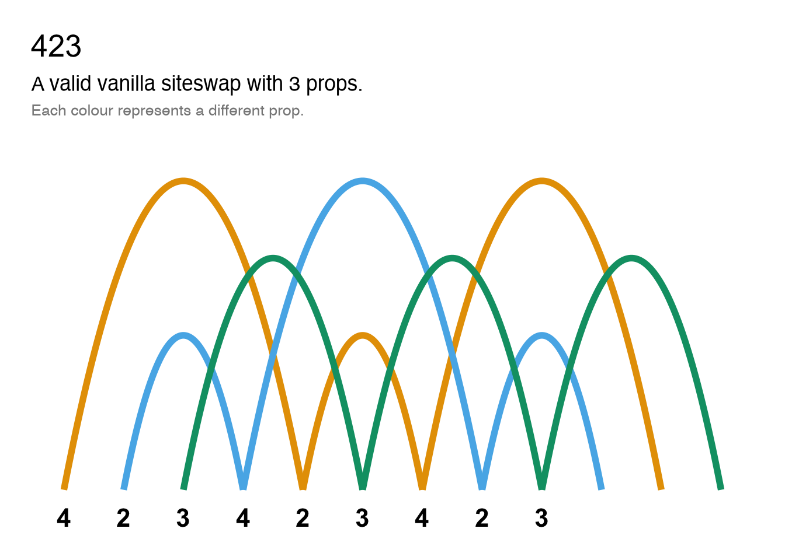
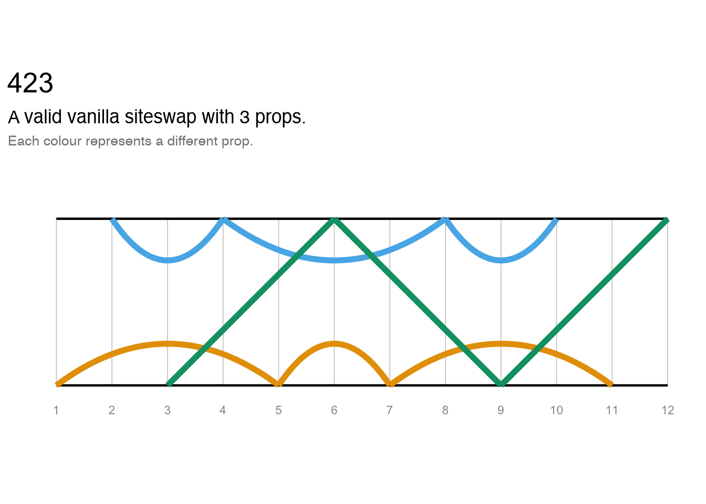
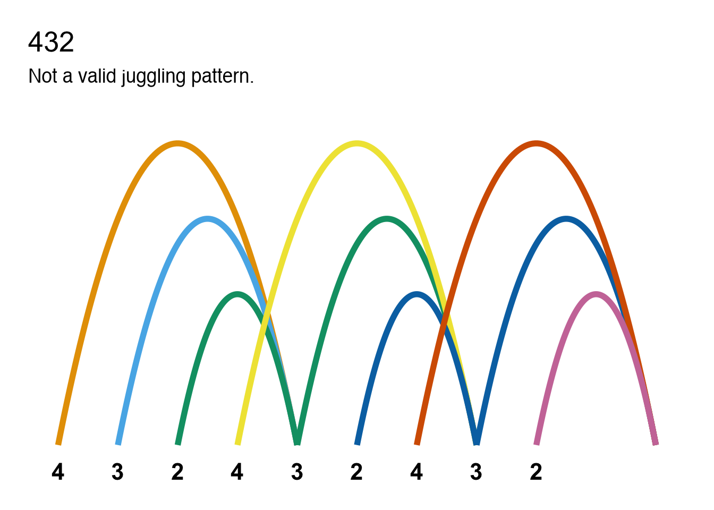
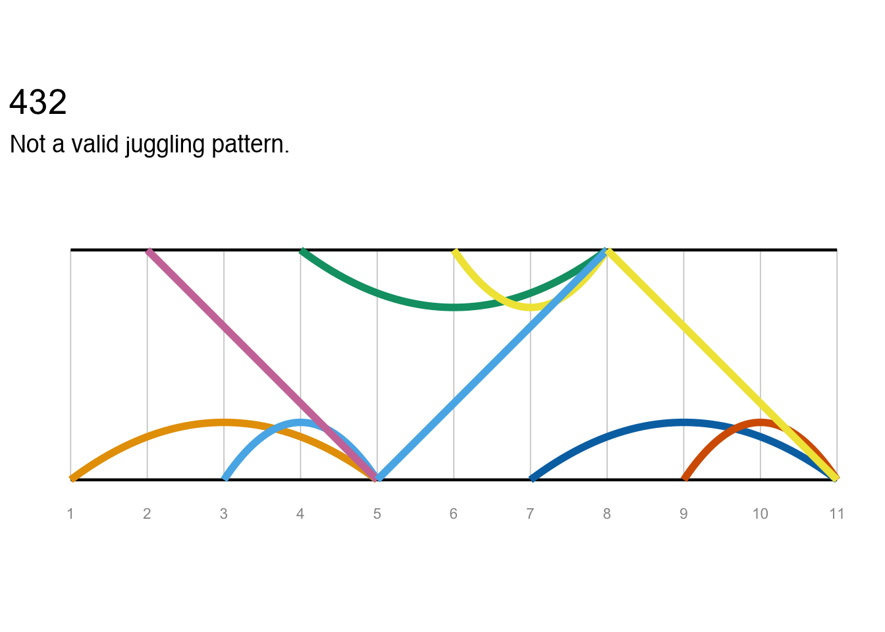

# jugglr

## Overview

**jugglr** is an R package for validating and visualising juggling
patterns expressed in [siteswap
notation](https://en.wikipedia.org/wiki/Siteswap). Create an object
representing a siteswap sequence with the
[`siteswap()`](https://ellakaye.github.io/jugglr/reference/siteswap.md)
function. This detects the siteswap notation type and returns an
[S7](https://rconsortium.github.io/S7) object of the appropriate
subclass: `vanillaSiteswap`, `synchronousSiteswap`, `multiplexSiteswap`,
`synchronousMultiplexSiteswap`, or `passingSiteswap`, all of which
inherit from an abstract `Siteswap` parent class. The print method for
each subclass reports whether the pattern is valid, how many props it
requires, and its period and symmetry.

The
[`timeline()`](https://ellakaye.github.io/jugglr/reference/timeline.md)
and [`ladder()`](https://ellakaye.github.io/jugglr/reference/ladder.md)
functions can be used to visualise any siteswap pattern (whether the
sequence is juggleable or not). The
[`animate()`](https://ellakaye.github.io/jugglr/reference/animate.md)
function generates an animated GIF of a valid pattern using the
[Juggling Lab GIF server](https://jugglinglab.org/html/animinfo.html),
which can be displayed in the Viewer pane or saved to a file.

## Installation

You can install the development version of jugglr from GitHub with:

``` r

pak::pak("EllaKaye/jugglr")
```

or via R-universe:

``` r

install.packages("jugglr", repos = "https://ellakaye.r-universe.dev")
```

For a full introduction to the package, see [get started
vignette](https://ellakaye.github.io/jugglr/articles/jugglr.html). For
the full range of animation options, see the [animation
article](https://ellakaye.github.io/jugglr/articles/animate.html).

## Siteswap

Types of siteswap notation supported by **jugglr**, with examples:

- vanilla: **423**
- synchronous: **(4,4)(4x,4x)**, **(4,2x)\***
- multiplex: **\[54\]24**
- synchronous multiplex: **(2,6x)(\[6x4x\],2x)**
- passing: **\<3p33\|3p33\>** or **\<4.5 3 3 \| 3 4 3.5\>**

Create an object with the
[`siteswap()`](https://ellakaye.github.io/jugglr/reference/siteswap.md)
function:

``` r

library(jugglr)
ss423 <- siteswap("423")
ss423
#> ✔ '423' is valid vanilla siteswap
#> ℹ It uses 3 props
#> ℹ It is symmetrical with period 3
```

Patterns that cannot be juggled are still `Siteswap` objects with the
appropriate subclass. Their print method reports that they are not valid
juggling patterns.

``` r

ss432 <- siteswap("432")
ss432
#> ✖ '432' is not a valid juggling pattern
#> ℹ Two or more throws land on the same beat (collision)
```

## Visualising the patterns

### Plots

[`timeline()`](https://ellakaye.github.io/jugglr/reference/timeline.md)
and [`ladder()`](https://ellakaye.github.io/jugglr/reference/ladder.md)
work across all siteswap types, returning ggplot2 objects that can be
further customised. The path of each prop is shown in a different
colour.
[`throw_data()`](https://ellakaye.github.io/jugglr/reference/throw_data.md)
returns the underlying data frame for use in custom visualisations.

[`timeline()`](https://ellakaye.github.io/jugglr/reference/timeline.md)
shows the throws and catches of each prop over time, with a focus on the
beat.
[`ladder()`](https://ellakaye.github.io/jugglr/reference/ladder.md)
additionally shows which hand throws and catches each prop.

``` r

timeline(ss423)
```



``` r

ladder(ss423)
```



These plots are also useful for understanding why non-valid sequences
are not jugglable. We can see, for example, where two props would need
to be caught at the same time (which is not permissible in vanilla
siteswap), or where props are “created” or “destroyed” (i.e. when the
sequence demands that a prop should be thrown or caught, but there’s not
a prop available to do so).

``` r

timeline(ss432)
```



``` r

ladder(ss432)
```



### Animation

**jugglr** provides a wrapper to the [Juggling Lab GIF
server](https://jugglinglab.org/html/animinfo.html). The
[`animate()`](https://ellakaye.github.io/jugglr/reference/animate.md)
function accepts valid siteswap sequences as plain strings or any
`Siteswap` object. Note that the Juggling Lab GIF server does not
recognise fractional passing notation, so `passingSiteswap` objects
using fractional notation cannot be animated.

If called in Positron or RStudio or a similar IDE,
[`animate()`](https://ellakaye.github.io/jugglr/reference/animate.md)
will show the animation in the Viewer pane, otherwise in the browser. If
a `path` argument is supplied, the animation will be saved to that
location instead. Note that it can take several seconds for the
animation to render, especially when the `colors` argument is specified.

``` r

animate("423", path = "man/figures/423-animation.gif", colors = c("#E69F00", "#56B4E9", "#009E73"))
```


