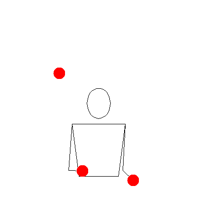
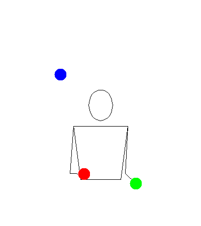
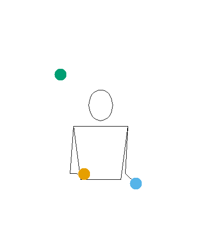
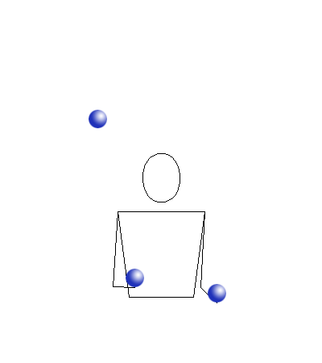
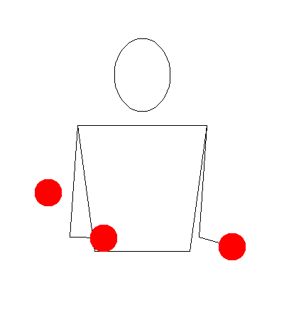
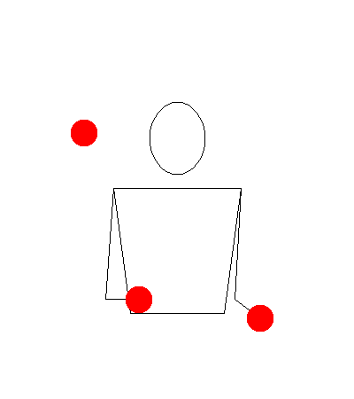

```{r, include = FALSE}
knitr::opts_chunk$set(
  collapse = TRUE,
  comment = "#>"
)
```

```{r setup}
library(jugglr)
```

Before you run `animate()`, know this: it talks to a server at [jugglinglab.org](https://jugglinglab.org) and downloads a GIF. You need an internet connection. The time it takes depends on the options you pass and whether JugglingLab has the pattern cached — typically a few seconds for a simple call, longer when you specify colours.

What you get back is a full animation of the pattern. For a juggler learning a new trick, or communicating a pattern to someone else, it's the most informative thing jugglr can produce.

## Basic usage

Pass a pattern as a string:

```{r basic-string, eval=FALSE}
animate("531")
```

```{r basic-gif, echo=FALSE, out.width="40%", fig.alt="Animated GIF of the 531 juggling pattern with default JugglingLab styling"}

```

In Positron or RStudio, the animation appears in the Viewer pane. Otherwise it opens in the browser.

You can also pass any `Siteswap` object directly — jugglr extracts the sequence string for you:

```{r basic-object, eval=FALSE}
animate(siteswap("531"))
```

The animation is identical either way.

One limitation: `passingSiteswap` objects using fractional notation (e.g. `"<4.5 3 3 | 3 4 3.5>"`) can't be animated because JugglingLab doesn't recognise that format. P-notation passing patterns (e.g. `"<3p 3|3p 3>"`) work fine.

## Colours

The `colors` argument is the most visually impactful option.

**No colours specified** — JugglingLab uses its default (a single colour):

```{r colors-default, eval=FALSE}
animate("531")
```

**`colors = "mixed"`** — each prop gets a different colour. Useful for tracking individual balls through the pattern:

```{r colors-mixed, eval=FALSE}
animate("531", colors = "mixed")
```

```{r colors-mixed-gif, echo=FALSE, out.width="40%", fig.alt="Animated GIF of the 531 pattern with each ball a different colour"}
knitr::include_graphics("figures/531-mixed.gif")
```

**`colors = "orbits"`** — props that follow the same path through the pattern share a colour. This is the most analytically useful mode: it shows you the orbit structure at a glance:

```{r colors-orbits, eval=FALSE}
animate("531", colors = "orbits")
```

```{r colors-orbits-gif, echo=FALSE, out.width="40%", fig.alt="Animated GIF of the 531 pattern with balls coloured by orbit"}

```

**Custom colours** — a vector of R colour names or hex codes, one per prop:

```{r colors-custom, eval=FALSE}
animate("531", colors = c("#E69F00", "#56B4E9", "#009E73"))
```

```{r colors-custom-gif, echo=FALSE, out.width="40%", fig.alt="Animated GIF of the 531 pattern with Okabe-Ito palette colours"}

```

These are the same Okabe-Ito colours used in `timeline()` and `ladder()` — a good choice if you want consistency across your visualisations.

Note that specifying colours takes noticeably longer than the default, because the coloured version isn't typically cached on the JugglingLab server.

## Props

The default prop is a ball. Rings and an image prop are also available:

```{r prop-ring, eval=FALSE}
animate("531", prop = "ring")
```

```{r prop-ring-gif, echo=FALSE, out.width="40%", fig.alt="Animated GIF of the 531 pattern with ring props"}
knitr::include_graphics("figures/531-ring.gif")
```

```{r prop-image, eval=FALSE}
animate("531", prop = "image")
```

```{r prop-image-gif, echo=FALSE, out.width="40%", fig.alt="Animated GIF of the 531 pattern with image props"}

```

## Speed and timing

Two parameters control the animation speed.

`slowdown` stretches the throw arcs in time — the JugglingLab default is `2.0`. Increase it to slow the animation down, which is useful when you're studying a new pattern:

```{r slowdown, eval=FALSE}
animate("531", slowdown = 4)
```

```{r slowdown-gif, echo=FALSE, out.width="40%", fig.alt="Animated GIF of the 531 pattern at reduced speed with slowdown = 4"}

```

`bps` sets the beats per second — the tempo of the pattern. Increase it to see the pattern at full juggling speed:

```{r bps, eval=FALSE}
animate("531", bps = 8)
```

```{r bps-gif, echo=FALSE, out.width="40%", fig.alt="Animated GIF of the 531 pattern at high speed with bps = 8"}

```

`width` and `height` control the pixel dimensions of the animation if you need a specific size.

## Saving animations to disk

To embed an animation in an R Markdown or Quarto document, save it to disk first and then reference the file:

```{r save-example, eval=FALSE}
animate("531", path = "figures/531.gif", colors = "orbits")
```

Then in a separate chunk:

```{r include-example, eval=FALSE}
knitr::include_graphics("figures/531.gif")
```

Set display options via chunk arguments: `out.width = "40%"` keeps the GIF from filling the full page width. This is the approach used throughout this vignette.

## Advanced parameters

`animate()` passes additional named arguments through to JugglingLab. A few worth knowing:

- `gravity`: the default feels like Earth. Set `gravity = 700` for a pattern that looks like it's being juggled somewhere with lower gravity:

```{r gravity, eval=FALSE}
animate("531", gravity = 700)
```

```{r gravity-gif, echo=FALSE, out.width="40%", fig.alt="Animated GIF of the 531 pattern with reduced gravity, showing higher arcing throws"}

```

- `propdiam`: prop diameter in metres. Adjust if the props look too large or small relative to the juggler.
- `camangle`: camera angle in degrees around the vertical axis. Useful for a different perspective on the pattern.
- `showground`: set to `true` to show the ground plane.

The full list of parameters is documented in the [JugglingLab GIF server reference](https://jugglinglab.org/html/animinfo.html).
