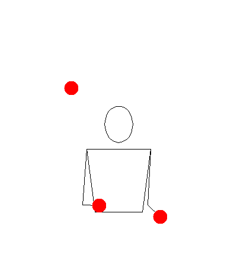
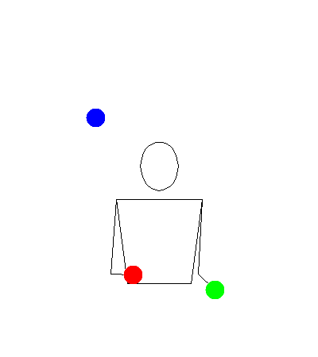
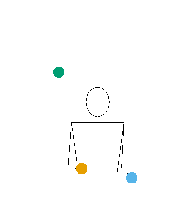
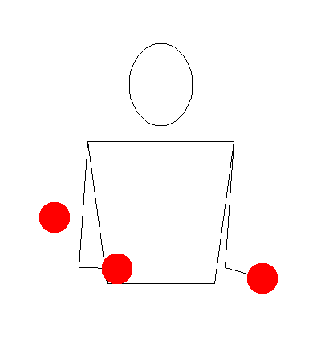

```{r, include = FALSE}
knitr::opts_chunk$set(
  collapse = TRUE,
  comment = "#>"
)
```

```{r setup}
library(jugglr)
```

The `animate()` function produces an animated GIF of a juggling pattern. It uses the [Juggling Lab GIF server](https://jugglinglab/html/animinfo.html) to generate the animation, so requires an internet connection. 
For a juggler learning a new trick, or communicating a pattern to someone else, 
these animations are a particularly useful visual aid.

The time it takes to render depends on the options you pass and whether Juggling Lab has the pattern cached. It will typically take a few seconds for a simple call, longer for more complex patterns. 
Setting the `colors` argument also notably increases the time it takes to render.

By default, `animate()` opens the animation in the Viewer pane of your IDE, if that's where you're calling it from, or in a browser otherwise. 
Setting the `path` argument althers this behavior, saving the GIF to disk at the specified location instead.

## Pattern

The `animate()` function requires a `pattern` to be specified. This can either be a string representing a siteswap sequence, or a `Siteswap` object (i.e. something created by the `siteswap()` function or one of the subclass constructor functions). 
The advantage of passing a `Siteswap` object over a string is that this already captures whether the pattern is a valid juggling sequence, and will throw an error in R if it is not, rather than waiting for the Juggling Lab server to reject it.

```{r basic-string, eval=FALSE}
animate("531")
animate(siteswap("531"))
```

These both produce the same animation:

```{r basic-gif, echo=FALSE, out.width="40%", fig.alt="Animated GIF of the 531 juggling pattern with default Juggling Lab styling"}

```

One limitation: `passingSiteswap` objects using fractional notation (e.g. `"<4.5 3 3 | 3 4 3.5>"`) can't be animated because Juggling Lab doesn't recognise that format. P-notation passing patterns (e.g. `"<3p 3 3|3p 3 3>"`) work fine.

## Named arguments

Juggling Lab has a large number of parameters that can be set to control the animation. The `animate()` function exposes a small subset of these as named arguments: `colors`, `prop`, `slowdown`, `bps`, `width` and `height`. 
These are all default to `NULL` (in R), which means that Juggling Lab's defaults are used. If you want to change any of these, you can pass an appropriate value to the argument. 

### Colours and props

For most variables, the value should be passed in the format described in the Juggling Lab documentation. The `colors` argument is the one exception, since R gives us more convenient and familiar ways of specifying colours than the Juggling Lab format. `colors` can be specified as color names, hex codes, or a positive integer, as per the `col` argument of `grDevices::col2rgb()`. Note that the way of specifying RGB colours in Juggling Lab is ***not*** supported as way of specifying `colors` in `animate()`. However, the special strings `"mixed"` (where each prop gets a different colour) and `"orbits"` are supported, which are the only two special strings recognised by Juggling Lab.
If `colors` is `NULL` (the R default), Juggling Lab uses its default (red).

```{r colors-mixed, eval=FALSE}
animate("531", colors = "mixed")
```

```{r colors-mixed-gif, echo=FALSE, out.width="40%", fig.alt="Animated GIF of the 531 pattern with each ball a different colour"}

```

```{r colors-custom, eval=FALSE}
animate("531", colors = c("#E69F00", "#56B4E9", "#009E73"))
```

```{r colors-custom-gif, echo=FALSE, out.width="40%", fig.alt="Animated GIF of the 531 pattern with Okabe-Ito palette colours"}

```

These are the same Okabe-Ito colours used by default in `timeline()` and `ladder()`.

Recognised `prop` arguments are `"ball"`, `"ring"`, and `"image"`. If `prop` is `NULL` (the R default), Juggling Lab uses its default (ball).

### Speed and timing

Two parameters control the animation speed: `slowdown` and `bps`.

`slowdown` stretches the throw arcs in time. The Juggling Lab default is `2.0`. Increase it to slow the animation down, which is useful when you're studying a new pattern:

```{r slowdown, eval=FALSE}
animate("531", slowdown = 4)
```

```{r slowdown-gif, echo=FALSE, out.width="40%", fig.alt="Animated GIF of the 531 pattern at reduced speed with slowdown = 4"}

```

`bps` sets the beats per second — the tempo of the pattern. Increase it to see the pattern at full juggling speed:

```{r bps, eval=FALSE}
animate("531", bps = 8)
```

```{r bps-gif, echo=FALSE, out.width="40%", fig.alt="Animated GIF of the 531 pattern at high speed with bps = 8"}

```

### GIF size
`width` and `height` control the pixel dimensions of the animation if you need a specific size, which default to 400 and 450 pixels respectively. The aspect ratio is fixed, so if you set one of these, the other is automatically adjusted to maintain the correct aspect ratio.

## Arguments through `...`
Any other variable allowed by Juggling Lab can be passed through `...` as key-value pairs, e.g. `propdiam = 20` will set the prop diameter to 20cm (from the default of 10cm). A full list of variables and the values they can take is documented in the [Juggling Lab GIF server reference](https://jugglinglab/html/animinfo.html). 

`animate()` will throw an error if you pass a parameter that Juggling Lab doesn't recognise, and will raise a warning if you pass a parameter that Juggling Lab recognises but ignores for web link animations.
