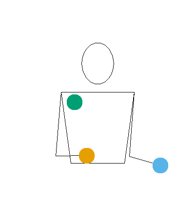

```{r, include = FALSE}
knitr::opts_chunk$set(
  collapse = TRUE,
  comment = "#>"
)
```

```{r setup}
library(jugglr)
```

Juggling sequences can be written in a notation called siteswap. A 3-ball cascade — the first sequence most jugglers learn — is written as "3", where each ball is thrown the same height and caught in the opposite hand three beats later. "531", "423" and "441" are also valid 3-ball juggling patterns, though with balls thrown to different heights, or caught in the same hand that throws them. Each number in a siteswap sequence encodes how many beats until that prop needs to be thrown again. However, not everything that can be written in siteswap is a valid/juggleable pattern. For the example, in the sequence "432", the first two props thrown would need to be caught in the same hand at the same time.

**jugglr** lets you create, validate, and visualise siteswap patterns in R.

There are several different types of siteswap, which can be distinguised through the notations: vanilla, sychronous, multiplex, synchronous multiplex, and passing, each explained in the [types of siteswap](LINK) section below.

In **jugglr**, we define a sequence with the function `siteswap()`, which creates an [S7](URL) object with class `Siteswap` as well as a child class corresponding to its type, i.e. `vanillaSiteswap`, `synchronousSiteswap`, `multiplexSiteswap`, `synchronousMultiplexSiteswap`, or `passingSiteswap`.

For each child class, there is a `print` method defined, showing the sequence and [whether it is valid](URL).
For valid sequences, we also see the number of props it requires, its period (how many beats before it repeats), and whether it is symmetrical (i.e. whether both hands do the same this, just offset in time).
For patterns that aren't valid, we see why not (either because it does not satisfy the average theorem, or because it has collisions).

There are also two visualisation methods that work for each class: `timeline()` which shows the beats on which each prop is thrown and caught, and `ladder()` which converys that information, as well as which hands the props are thrown from and caught it.
These visualisations are useful both for seeing how valid sequences fit together, 
as well as for diagnosing why invalid sequences do not work.

## Vanilla siteswap

The simplest form is *vanilla* siteswap: one prop thrown per beat, hands alternating. Create a pattern with `siteswap()`:

```{r vanilla-cascade}
siteswap("3")
```

The print method tells you four things: whether the pattern is valid, how many props it requires, its period (how many beats before it repeats), and whether it's symmetrical — meaning both hands do the same thing, just offset in time.

Here's a trickier pattern:

```{r vanilla-423}
ss_423 <- siteswap("423")
ss_423
```

Still three props, period 3. The 4 is a high self-throw that buys you a moment, the 2 is a low hold, and the 3 is a standard cascade throw. The pattern starts to take shape even from the numbers. And for the jugglers working towards five balls:

```{r vanilla-5}
siteswap("5")
```

### Invalid patterns

Not every sequence of numbers makes a jugglable pattern. jugglr checks validity at construction:

```{r vanilla-invalid}
ss_21 <- siteswap("21")
ss_21
```

Two problems, both reported separately. The average of 2 and 1 is 1.5, which would require 1.5 props — impossible. And even setting that aside, two throws would land on the same beat: a collision. The diagrams in the [visualising patterns](#visualising-patterns) section below make this concrete.

This is genuinely useful when you're inventing patterns. Check the sequence before picking up the clubs.

## Other notation types

Vanilla siteswap is one prop per beat from alternating hands. jugglr handles four more notation types for more complex juggling styles.

### Synchronous siteswap

Both hands throw at the same time, written as pairs in parentheses:

```{r sync}
siteswap("(4,4)")
```

An `x` suffix on a throw value marks it as crossing to the other side. The `*` shorthand indicates the pattern alternates between two states — jugglr expands it into the full sequence:

```{r sync-alt}
siteswap("(4,2x)*")
```

### Multiplex siteswap

Multiple props thrown from one hand simultaneously, with square brackets grouping them:

```{r multiplex}
siteswap("[43]1")
```

### Synchronous multiplex siteswap

Both hands throwing at the same time, with multiplex groups:

```{r sync-multiplex}
siteswap("(4,[42x])*")
```

### Passing siteswap

Patterns for multiple jugglers. The `<A|B>` notation separates each juggler's sequence; `p` on a throw value marks a pass to the other juggler:

```{r passing-p}
siteswap("<3p 3|3p 3>")
```

Six props between two jugglers, each passing on every other throw. Experienced passers often prefer fractional notation, where a `.5` on a throw indicates it's a pass:

```{r passing-frac}
siteswap("<4.5 3 3 | 3 4 3.5>")
```

## Visualising patterns {#visualising-patterns}

A sequence of numbers only tells you so much about a pattern. jugglr provides two diagrams, each revealing different aspects of the same sequence.

Both `timeline()` and `ladder()` return ggplot2 objects, so you can customise them further with standard ggplot2 functions.

### Timeline

`timeline()` draws arcs: each arc represents one throw, with height proportional to the throw value, colour-coded by prop. It's roughly what the pattern looks like from the side.

```{r timeline-valid, fig.alt="Timeline arc diagram for the 423 pattern, showing three arcs per cycle colour-coded by prop"}
timeline(ss_423)
```

Follow any single colour to track one prop through the pattern. Each arc shows when it was thrown, how high, and when it lands.

### Ladder diagram

`ladder()` shows the schedule: beats across the axis, with lines connecting throws to catches. Straight lines are self-throws; crossing lines go to the other hand.

```{r ladder-valid, fig.alt="Ladder diagram for the 423 pattern showing throws and catches connected by lines"}
ladder(ss_423)
```

Where the timeline shows the shape of the pattern in the air, the ladder shows the mechanics hand-to-hand.

### Invalid patterns

Both diagrams become most instructive when something goes wrong:

```{r timeline-invalid, fig.alt="Timeline diagram for the invalid 21 pattern, showing a collision where two arcs land on the same beat"}
timeline(ss_21)
```

```{r ladder-invalid, fig.alt="Ladder diagram for the invalid 21 pattern, showing two lines converging at the same beat"}
ladder(ss_21)
```

The collision is visible: two arcs land on the same beat, two lines converge at the same point. The colours show where props appear out of nowhere or need to be in two places at once. This is a useful debugging tool when an invented pattern doesn't feel right — the diagram tells you exactly where it breaks.

### Passing patterns

Both diagrams extend naturally to passing patterns, with one lane per juggler:

```{r timeline-passing, fig.alt="Timeline arc diagram for the <3p 3|3p 3> passing pattern, with two juggler lanes and passes arcing between them"}
ss_pass <- siteswap("<3p 3|3p 3>")
timeline(ss_pass)
```

```{r ladder-passing, fig.alt="Ladder diagram for the <3p 3|3p 3> passing pattern, with two juggler rows and passes shown as diagonal lines"}
ladder(ss_pass)
```

Passes appear as arcs (or lines) that cross between the juggler lanes.

### A few options

The `n_cycles` argument controls how many repetitions to show — the default of 3 is usually enough to see the full structure, but increase it to trace individual props further. `ladder()` also accepts `direction = "vertical"` if you prefer that orientation.

## The raw data

If you want to build your own visualisation or work directly with the numbers, `throw_data()` returns the underlying data frame:

```{r throw-data}
throw_data(ss_423)
```

One row per throw: when it was thrown, which hand, the throw value, when and where it lands, and which prop it belongs to. This is the same data that drives the diagrams.

## Animation

jugglr can also produce animated GIFs of patterns via the [JugglingLab](https://jugglinglab.org) server. Here's `423` animated with three colours:

```{r animate-teaser, eval=FALSE}
animate("423", colors = c("#E69F00", "#56B4E9", "#009E73"))
```

```{r animate-gif, echo=FALSE, out.width="40%", fig.alt="Animated GIF of the 423 juggling pattern with three coloured balls"}

```

The `animate` vignette covers the full range of options: colour modes, prop types, speed controls, and how to save animations to disk for use in documents.
