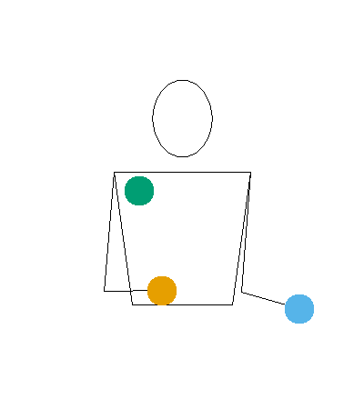

```{r, include = FALSE}
knitr::opts_chunk$set(
  collapse = TRUE,
  comment = "#>"
)
```

```{r setup}
library(jugglr)
```

## Introduction to siteswap notation

Juggling sequences can be written in a notation called siteswap. Each number in a siteswap sequence encodes how many beats until that prop is thrown again. The simplest form is *vanilla* siteswap: one prop thrown per beat, hands alternating.

A 3-ball cascade — the first sequence most jugglers learn — is written as "3", where each ball is thrown the same height, caught in the opposite hand and thrown again three beats later. "531", "423" and "441" are also valid 3-ball juggling patterns. A "4" is thrown and caught in the same hand, a "5" is similar to a "3" but thrown higher, a "2" is held in the hand for one beat, and a "1" is a quick pass to the other hand. However, not everything that can be written in siteswap is a valid, juggleable pattern. For example, in the sequence "432", the first two props thrown would need to be caught in the same hand at the same time.

**jugglr** lets you create, validate, and visualise siteswap patterns in R.

There are several different types of siteswap, distinguished by their notation: vanilla, synchronous, multiplex, synchronous multiplex, and passing:

- vanilla:**423**
- synchronous (throwing a ball from each hand simultaneously): **(4,4)(4x,4x)**, **(4,2x)\***
- multiplex (throwing multiple balls from the same hand simultaneously): **[54]24**
- synchronous multiplex: **(2,6x)([6x4x],2x)**
- passing (throwing between more than one juggler): **<3p33|3p33>** or **<4.5 3 3 | 3 4 3.5>**

See the Wikipedia article on [siteswap](https://en.wikipedia.org/wiki/Siteswap) for a more detailed introduction to each type and the notation.

## Introduction to jugglr

In **jugglr**, you define a sequence with the function `siteswap()`, which creates an [S7](https://rconsortium.github.io/S7/) object with class `Siteswap` as well as a child class corresponding to its type: `vanillaSiteswap`, `synchronousSiteswap`, `multiplexSiteswap`, `synchronousMultiplexSiteswap`, or `passingSiteswap`.

```{r vanilla}
#| echo: true
library(jugglr)
ss423 <- siteswap("423")
ss423
```

Note that `siteswap()` is a factory function. It parses the sequence to determine the type of siteswap and calls the appropriate constructor for that type, e.g. `vanillaSiteswap()`. Each of these specific classes also has the abstract `Siteswap` class as a parent.

Printing a `Siteswap` object shows the sequence and whether it is a valid juggling pattern.
For valid sequences, it also reports the number of props the pattern requires, its period (how many beats before it repeats), and whether it is symmetrical (i.e. whether both hands do the same thing, just offset in time).

Patterns that cannot be juggled are still `Siteswap` objects with the appropriate subclass. Their print method reports that they are not valid juggling patterns.

For patterns that aren't valid, it reports why not: either the sequence does not satisfy the average theorem (i.e. couldn't be juggled with a whole number of props) or it has collisions.

```{r invalid}
#| echo: true
ss432 <- siteswap("432")
ss432
```

## Visualising the patterns

`timeline()` and `ladder()` work across all siteswap types, returning ggplot2 objects that can be further customised. The path of each prop is shown in a different colour. Both diagrams colour throws by prop using the colour-blind-friendly [Okabe-Ito palette](https://clauswilke.com/dataviz/color-pitfalls.html#not-designing-for-color-vision-deficiency) (up to seven props, after which ggplot2's default scale takes over). 

`timeline()` shows the throws and catches of each prop over time, with a focus on the beat. It draws arcs: each arc represents one throw, with height proportional to the throw value, colour-coded by prop. 

`ladder()` additionally shows which hand throws and catches each prop. 
The 'rails' of the ladder represent the hands, with straight lines between them representing throws caught in the opposite hand, and arcs representing throws caught in the same hand.

`throw_data()` returns a data frame containing information about each throw and catch, which can be used for custom visualisations.

```{r timeline-valid}
timeline(ss423)
```

```{r ladder-valid}
ladder(ss423)
```

These plots are also useful for understanding why non-valid sequences are not jugglable.
We can see, for example, where two props would need to be caught at the same time
(which is not permissible in vanilla siteswap), or where props are "created" or "destroyed" (i.e. when the sequence demands that a prop should be thrown or caught, but there's not a prop available to do so).

```{r timeline-invalid}
timeline(ss432)
```

```{r ladder-invalid}
ladder(ss432)
```

`timeline()` plots for synchronous patterns are drawn two-sided: one hand's arcs sit above a faint centre line and the other's below it.

```{r sync-timeline} 
timeline(siteswap("(4,4)(4x,4x)"))
```

Multiplex patterns in which a hand throws two props at once with the same value are fanned apart so each prop is visible (which corresponds to the way jugglers throw them in real life): By detault, timelines show three cycles of the pattern, but you can increase this with the `n_cycles` argument - this is recommended for patterns with short cycles:

```{r}
timeline(siteswap("[33]"), n_cycles = 6)
```

Both `timeline()` and `ladder()` have `title` and `subtitle` arguments, which are `TRUE` by default - the title shows the sequence and the subtitle shows the validity and number of props, and explains that colours represent props. If you prefer to set your own titles, set these to `FALSE` and use `ggplot2::labs()` to add your own. Since these plots return ggplot2 objects, they can be further customised with any standard ggplot2 function:

```{r ggplot-customise, fig.alt="Timeline diagram for the 423 pattern with a custom title added via ggplot2::labs()"}
library(ggplot2)
timeline(ss423, subtitle = FALSE) +
  labs(title = "423 or W") +
  scale_colour_manual(values = c("#D4006A", "#006AD4", "#00D46A"))
```


### Synchronous patterns

Both diagrams adapt to each notation type. Because synchronous patterns throw from both hands at once, the timeline is drawn two-sided: one hand's arcs sit above a faint centre line and the other's mirror below it, each with its own throw labels.

```{r timeline-sync, fig.alt="Two-sided timeline for the synchronous (4,2x)* pattern, with one hand's arcs above the centre line and the other's mirrored below"}
ss_sync <- siteswap("(4,2x)*")
timeline(ss_sync)
```

The ladder follows suit, numbering only the even beats, since both hands throw together:

```{r ladder-sync, fig.alt="Ladder diagram for the synchronous (4,2x)* pattern, numbered on even beats only"}
ladder(ss_sync)
```

### Multiplex patterns

When a hand throws two identical props at once, their arcs would otherwise land on top of each other. Both diagrams fan such throws apart — to slightly different heights in the timeline, and into separate curves in the ladder — so each prop stays visible:

```{r timeline-multiplex, fig.alt="Timeline for the multiplex [22]2 pattern, with the two simultaneous throws fanned to slightly different heights"}
ss_mult <- siteswap("[22]2")
timeline(ss_mult)
```

```{r ladder-multiplex, fig.alt="Ladder diagram for the multiplex [22]2 pattern, with the two simultaneous throws fanned into separate curves"}
ladder(ss_mult)
```

### Passing patterns

Both diagrams extend naturally to passing patterns, with one lane per juggler:

```{r timeline-passing, fig.alt="Timeline arc diagram for the <3p 3|3p 3> passing pattern, with two juggler lanes and passes arcing between them"}
ss_pass <- siteswap("<3p 3|3p 3>")
timeline(ss_pass)
```

```{r ladder-passing, fig.alt="Ladder diagram for the <3p 3|3p 3> passing pattern, with two juggler rows and passes shown as diagonal lines"}
ladder(ss_pass)
```

Passes appear as arcs (or lines) that cross between the juggler lanes.

### A few options

The `n_cycles` argument controls how many repetitions to show — the default of 3 is usually enough to see the full structure, but increase it to trace individual props further. `ladder()` also accepts `direction = "vertical"` if you prefer that orientation.

## The raw data

If you want to build your own visualisation or work directly with the numbers, `throw_data()` returns the underlying data frame:

```{r throw-data}
throw_data(ss423)
```

One row per throw: when it was thrown, which hand, the throw value, when and where it lands, and which prop it belongs to. This is the same data that drives the diagrams.

## Animation

jugglr can also produce animated GIFs of patterns via the [JugglingLab](https://jugglinglab.org) server. Here's `423` animated with three colours:

```{r animate-teaser, eval=FALSE}
animate("423", colors = c("#E69F00", "#56B4E9", "#009E73"))
```

```{r animate-gif, echo=FALSE, out.width="40%", fig.alt="Animated GIF of the 423 juggling pattern with three coloured balls"}

```

The [animation article](https://ellakaye.github.io/jugglr/articles/animate.html) covers the full range of options: colour modes, prop types, speed controls, and how to save animations to disk for use in documents.
